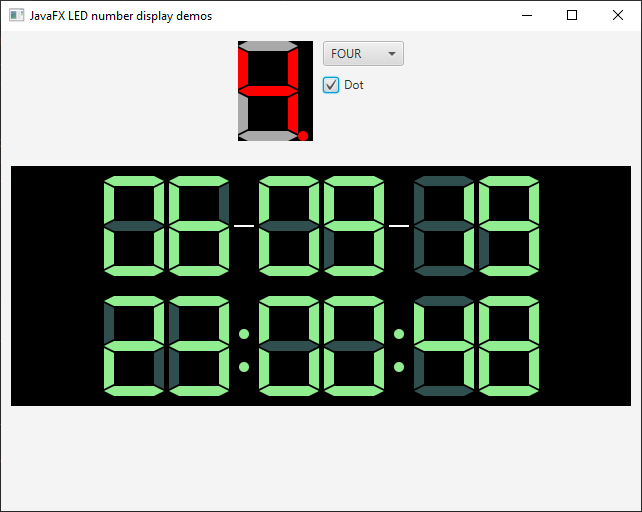

# JavaFX LED number display
JavaFX version of a LED number display as used in electronics projects.

## Info
Made with Java 11 and JavaFX 11.

## How to use
Basic example to use a LED number to a HBox:
````
LedNumber ledNumber = new LedNumber(DisplaySkin.CLASSIC, Color.BLACK, Color.DARKGRAY, Color.RED);

HBox holder = new HBox();
holder.getChildren().add(ledNumber);

ledNumber.highlight(HighLightType.FOUR);
````

Check the DemoApp.java which contains some examples.

